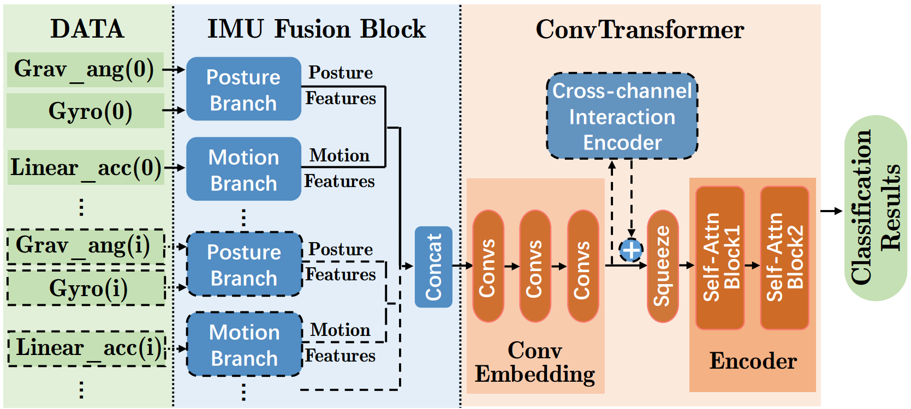
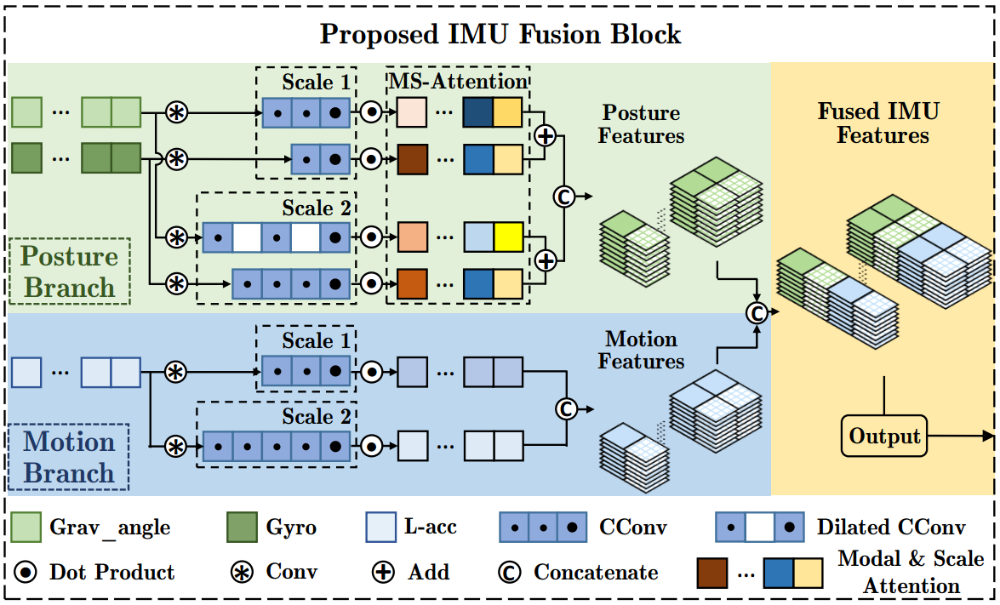

# If-ConvTransformer
This is the project of manuscript If-ConvTransformer: A Framework for Human Activity Recognition Using IMU Fusion and ConvTransformer, Ye Zhang, Longguang Wang, Huiling Chen, et. al, IMWUT/UbiComp 2022 [[Paper]](https://dl.acm.org/doi/pdf/10.1145/3534584). **Our team will release more interesting works and applications on sensor based time series (including HAR) soon. Please keep following our repository.**



## Algorithm Introduction

This paper proposes an HAR framework composed of an IMU fusion block and a ConvTransformer subnet. Extensive experiments on eight benchmark datasets demonstrate the superior  performance of our framework. The contributions of this paper are summarized as follows:

- We propose an HAR framework, which comprises an IMU fusion block and a ConvTransformer subnet.
- We introduce an IMU fusion block for multi-sensor modal fusion. By taking the physical prior knowledge of  different sensors into account, our IMU fusion block fuses the extracted features from multiple modalities effectively.
- With explicit motivations, we apply ConvTransformer as the backbone network. Moreover, the in-depth  analyses of ConvTransformer are also provided, which also support our motivations.
- Our proposed HAR framework achieves superior performance on five smartphone based datasets and three wearable device based datasets.



## Citation

```
@article{zhang2022if,
  title={IF-ConvTransformer: A framework for human activity recognition using IMU fusion and ConvTransformer},
  author={Zhang, Ye and Wang, Longguang and Chen, Huiling and Tian, Aosheng and Zhou, Shilin and Guo, Yulan},
  journal={Proceedings of the ACM on Interactive, Mobile, Wearable and Ubiquitous Technologies},
  volume={6},
  number={2},
  pages={1--26},
  year={2022},
  publisher={ACM New York, NY, USA}
}
```

## Prerequisite

Tested on Windows 10  , with Python 3.6, PyTorch 1.1, CUDA 10.0, and 1x NVIDIA 2080Ti.

## Usage

On windows:

```
Click on main.py and run it. Adjust the hyperparameters in the constant file.
```

Or:

**(1) Train.**

HAPT dataset

```python
python main.py --PATTERN TRAIN --DATASETS HAPT --CLASSIFIERS If_ConvTransformer_torch --BATCH_SIZE 128 --EPOCH 30 --LR 0.0002 --test_split 15
```

Opportunity dataset

```python
python main.py --PATTERN TRAIN --DATASETS Opportunity --CLASSIFIERS If_ConvTransformer_W_torch --BATCH_SIZE 64 --EPOCH 100 --LR 0.0005 --test_split 50
```

**(2) Test.**

HAPT dataset

```
python main.py --PATTERN TEST --DATASETS HAPT --CLASSIFIERS If_ConvTransformer_torch --test_split 15
```

Opportunity dataset

```
python main.py --PATTERN TEST --DATASETS Opportunity --CLASSIFIERS If_ConvTransformer_W_torch --test_split 50
```

The **'If_ConvTransformer_torch'** classifier is prepared for **smartphone** based datasets.

The **'If_ConvTransformer_W_torch'** classifier is prepared for **wearable device** based datasets.

## Other Explanations

The project is just a shorthand version, since we will expand this conference work into a journal article. However, **we absolutely have plans to release the whole HAR framework (including codes of data preprocessing, SOTA HAR methods, evaluation metrics et. al). It won't take long! Please keep following our repository!**